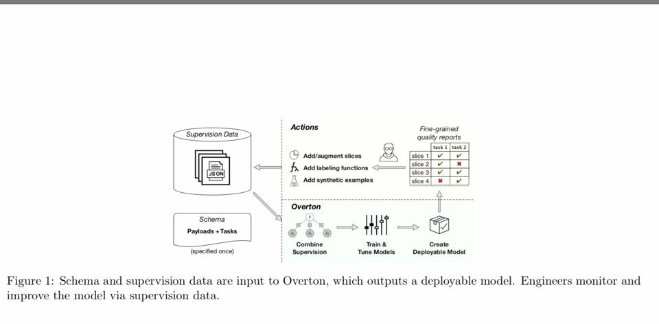
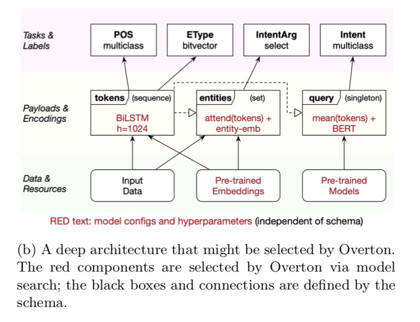
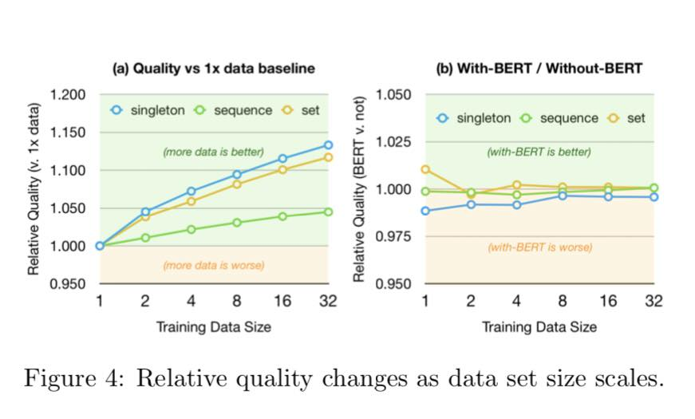

# OVERTON-from-Apple

Watch out for OVERTON from Apple. It automates AI system lifecycles by providing a set of novel high-level abstractions.

Actually, it makes developers go CODE-less to build deep-learning-based applications without writing any code in frameworks like TensorFlow.

Read more: https://arxiv.org/pdf/1909.05372.pdf
